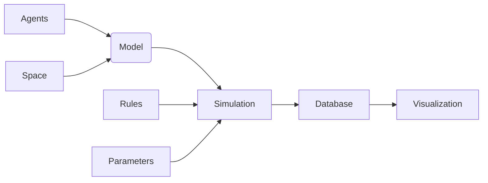

# Billu

An agent based modeling python package.

[](https://codecov.io/gh/sumanan047/billu)




## Agents

- color
- position
- shape (right now they are all square)
- size (length and width, default (1,1))
- properties (***kwargs)

## AgentSet

A set of agents that share similar ( or same) properties depends on the user but they are one object sharing
properties and this can be utilized. AgentSet can all be initialized with various kind of statistical distributions.

For size and position, two dimensional distributions are used and for agentset_properties one dimensional distributions
can be used.

- distribution of positions
- distrinution of sizes
- distribution of colors

## Space

An empty space in 2D with each grid point having no properties other than space cordinates.

- physical properties (***kwargs)

## SpacePatch

Subsets of space in 2D with each grid point of it being a subset of the total space of simulation.
The sum of all SpacePatches in the model must make up together the whole Space. (assert needed)

- Union test
- properties (***kwargs)

## Model

> A model is a collection of agents, space and rules.

- AgentSet/Agent
- SpacePatch/Space

## Rules

> A rule is function that modifies properties of agent/agents or globals (space is also a type of agent) in the model.
**Over a single timestep a set of rules for agents, spaces and globals are executed.**

- A rule can take one, two or more agents as input and modify their properties.

- All rules should be functions. Few rules have been provided in the package. Others can be added by the user as per need.

- A rule must be defined as a function that follows following pattern and must accomplish two things:

    1. Modify agent properties
    2. Update the agent property in their dictionary

```python
def rule_name(agent1, **kwargs):
    # 1.0 modify agent1 properties
    agent1.property = value
    # update agent1 properties
    agent1.agent_dict['property'] = agent1.property
```

## Simulation

> A simulation is an execution of a model over a period of time.

A simulation should have a clock that ticks with start of the simulation and stops when the simulation stops.

**With each tick there should be a set of rules that are executed over the agents, spaces and globals.**

A simulation should have a database that stores the state of the model at each tick.

A simulation will also have a visualization method that will visualize the state of the model at each tick with the help of a callback function or a database.


## Database

> A database is a collection of models that a user can store and retrieve.

> &copy; 2025 The Short Epoch. All Rights Reserved.
