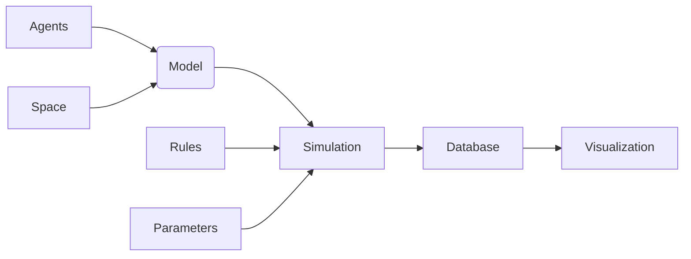

# Billu

An agent based modeling python package.

## Agents

- color
- position
- shape (right now they are all square)
- size (length and width, default (1,1))
- properties (***kwargs)

## AgentSet

A set of agents that share similar ( or same) properties depends on the user but they are one object sharing
properties and this can be utilized. AgentSet can all be initialized with various kind of statistical distributions.

For size and position, two dimensional distributions are used and for agentset_properties one dimensional distributions
can be used.

- distribution of positions
- distrinution of sizes
- distribution of colors

## Space

An empty space in 2D with each grid point having no properties other than space cordinates.

- physical properties (***kwargs)

## SpacePatch

Subsets of space in 2D with each grid point of it being a subset of the total space of simulation.
The sum of all SpacePatches in the model must make up together the whole Space. (assert needed)

- Union test
- properties (***kwargs)

## Model

- AgentSet/Agent
- SpacePatch/Space
